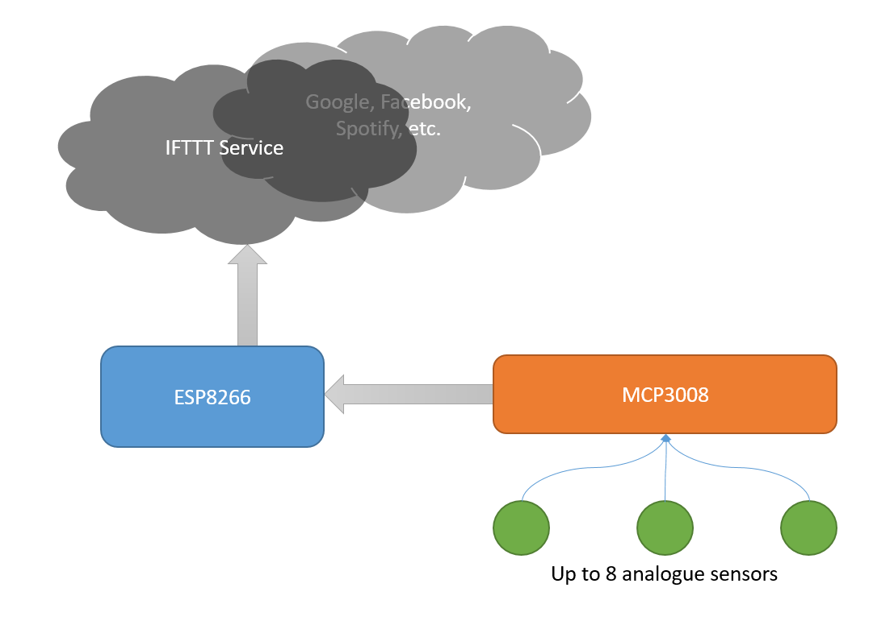
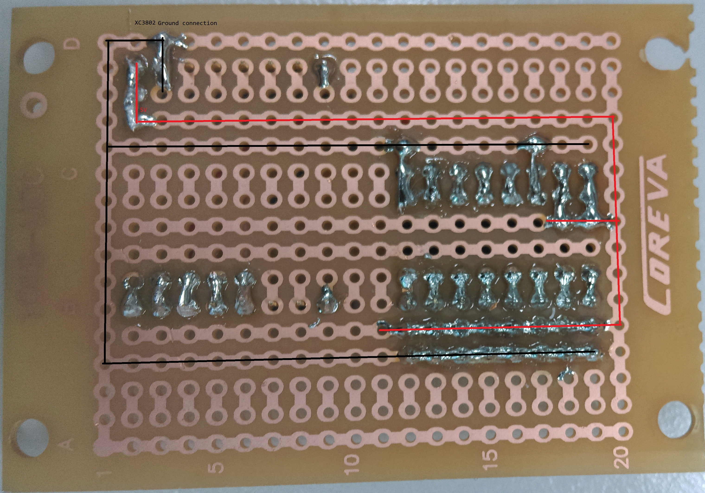
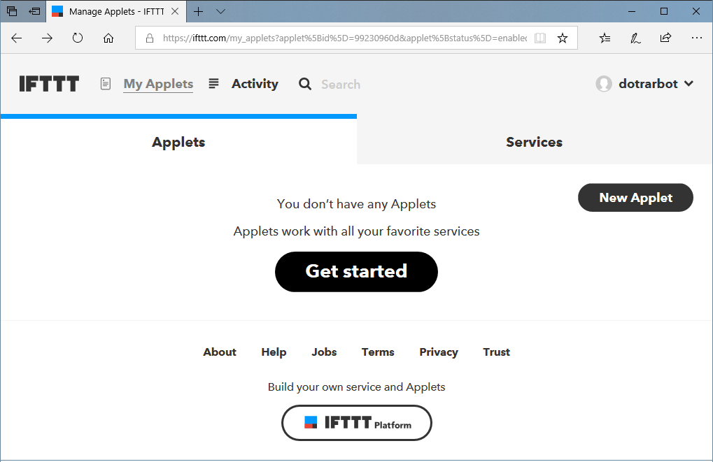
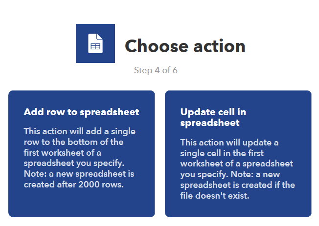
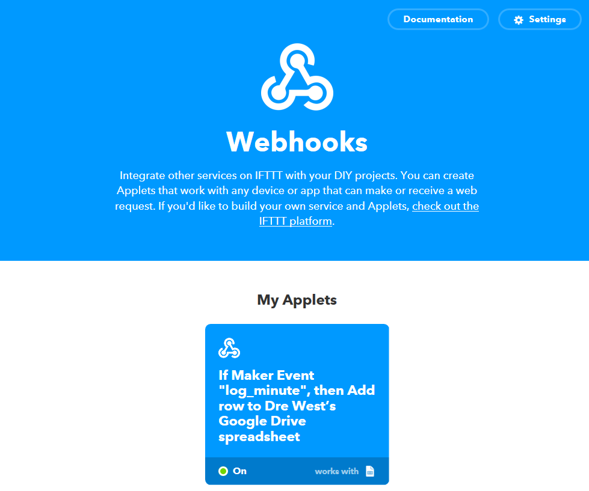

# WiFi Datalogger
 Use ESP8266 and IFTTT Services to control the cloud

Do you have a garden or home-brewing set up that you need to monitor multiple things at once? This project uses the popular "IF THIS THEN THAT" service (IFTTT) with the MCP3008 chip to send your sensor data to the cloud! Example code has Google sheets and Gmail functionality, and 3 sensors are bundled below. Try out all 3 or mix and match your own.									
| Input | Output | 
| ----- | ------ | 
| Sensors | Graphs |

<!-- TOC -->

- [WiFi Datalogger](#wifi-datalogger)
    - [Bill of materials](#bill-of-materials)
    - [Software & Libraries](#software--libraries)
    - [System overview](#system-overview)
        - [Circuit Connections](#circuit-connections)
        - [IFTTT Setup](#ifttt-setup)
    - [Sensors](#sensors)
    - [Integration](#integration)
    - [Use](#use)
    - [Future improvements](#future-improvements)
    - [Further reading](#further-reading)

<!-- /TOC -->

## Bill of materials 

| Qty | Code | Description | 
| --- | ---- | ----------- | 
|  1  | [XC3802](https://jaycar.com.au/p/XC3802) | ESP8266 board
|  1  | [ZK8868](https://jaycar.com.au/p/ZK8868) | Microchip MCP3008 8ch ADC 
|  1  | [HP9550](https://jaycar.com.au/p/HP9550) | Prototyping board
|  1  | [WC6026](https://jaycar.com.au/p/WC6026) | Socket socket leads
|  1  | [XC4494](https://jaycar.com.au/p/XC4494) | Temperature sensor
|  1  | [XC4604](https://jaycar.com.au/p/XC4604) | Soil moisture sensor
|  1  | [RD3485](https://jaycar.com.au/p/RD3485) | Light dependent resistor
|  1  | [HM3211](https://jaycar.com.au/p/HM3211) | Header pins
|  1  | [RR0596](https://jaycar.com.au/p/RR0596) | 10k resistors


## Software & Libraries

This project uses the IFTTT service, found at
* https://ifttt.com/discover

It also uses the following arduino library:

| Library | Author | Version |
| --- | --- | --- | 
| ArduinoJson | Benoit Blanchon | 6.11.2 |


## System overview 



Luckily for us, the heavy lifting is done through the IFTTT service, which makes things a lot simplier. IFTTT Provides a url that we can access with our ESP8266 and send data to; When the data is uploaded, IFTTT can then apply it to any other serivce that you want; in our case we will put it on a [Google Sheets](https://www.google.com/sheets/about/) spreadsheet.

The XC3802 board only has 1 analog pin, up to 1 volt, which is pretty insufficient for most cases, so we use the MCP3008 chip ([ZK8868](https://jaycar.com.au/p/ZK8868)) as our Analog to Digital converter (8 channels, 5V, 10bit resolution - beefy!) and receive the information on the ESP to send to IFTTT.

One limitation of the free IFTTT service is that you can only upload 3 values at a time, but that can be overcome by the ArduinoJson library or by doing some [bit manipulation](https://codeburst.io/your-guide-to-bit-manipulation-48e7692f314a)

### Circuit Connections
 The general connections are very simply connecting the MCP to the ESP.

 

Looking at the MCP datasheet, the entire left side of the chip are the analog channels, and the right side of the chip has our SPI connections on pins 10,11,12 and 13, making the wiring very easy. 

| MCP3008 | XC3802 | Description | 
| ---- | --- | --- | 
| 10 | D8 | Chip select | 
| 11 | D7 | SPI MoSi |
| 12 | D6 | SPI MiSo | 
| 13 | D5 | SPI CLK  | 

Laying it out on the circuit board makes for easy work


Here we used the headers from the pack of the XC3802, and broke the 28pin header into the 3x8 grid next to the chip, looking under the board shows why:



With the ease of this HP9509 prototyping board, the 3 pins next to the chip's position has 2 rails and the chip leg connection. This makes for super simple work to connect up the power and ground rails across the whole grid so that every sensor has it's own +5V and GND. 

We also bridge the `AGND` and `Vref` of the MCP3008 to the Ground and 5V rails respectively; as we want the full 5V range to be available on the ADC conversion. 

Then Bridge the 5V and GND from the XC3802 board to the correct rails. Make sure you know which one is which, as it is reversed when you look at it from the underside! 

### IFTTT Setup

IFTT is easy to set up; feel free to skip this part if you're comfortable. We need to make a new applet that connects the google sheet service to the "Maker" Service which provides our URL for us to send data to. 

Start with creating an account and logging in, then press "new applet"



First click the blue "This" to create the first part of our setup, which is "receive a web request" - as in: *"WHEN we receive a web request ( coming from our ESP) THEN ..."*


You can call the event anything you want, ours will just be `log_minute`


Then we click on the blue "That" to set up the result of our trigger; 


You can see there are many services that you are able to use; including gmail and our google-sheets. 


We just want to "add row to spreadsheet" for our purposes; This is just a simple datalogging tutorial project; you can really do a lot more with this service. 



Once that service is made, you're finished, you will just need your webhooks key to put in the arduino code so that the ESP can trigger the right event you want. 

## Sensors 

Each of the sensors should have a `S` as well as a `-` and `+` - use this to connect to the header grid, noting which pin is positive. It might be best to mark which row has positive and which has negative so that you do not get confused down the track. 

The only exception is the LDR which needs a bit more manual set up. This is a simple [Voltage Divider](https://en.wikipedia.org/wiki/Voltage_divider) circuit, with one of the resistors being the LDR. 

We used 3 leads to solder between the resistor and the LDR,


## Integration
<!-- How to join it all together -->
Once you have the circuit made and ready to upload data, you need to first check your webhooks in IFTTT to get the correct key and event name. 

Firstly, Click on your services tab, then click on webhooks. 



In the webhooks service, you can find settings in the top right, which will provide you with a Account URL. The final part of this URL is your KEY.


In the datalog.ino, you can see the URL which has `EVENT_NAME_HERE` and `YOUR_KEY_HERE` - replace these with what your event name and key is, so that it is all one string variable. 

```c 
const char* URL = "http://maker.ifttt.com/trigger/EVENT_NAME_HERE/with/key/YOUR_KEY_HERE";

//should become ->

const char* URL = "http://maker.ifttt.com/trigger/log_minute/with/key/asdf1234qwetyuiopetcexample";
```

There is also the variables for your WiFi SSID and password as well.
```c 
const char* WIFI_SSID = "wifiName";
const char* WIFI_PASS = "wifiPassword";
```
Connect up the ESP, change the board type to WeMos D1, and press upload. You can open the Serial monitor and view what it is doing to debug any issues.

## Use

Once the data is uploading you can use it for any purpose. You could connect different soil / moisture / windspeed type of sensors and make your own weather logger. The information is transmitted and stored proportional to the voltage on the MCP3008's pins, between 0V and 5V.


When in google sheets, you would be able to select the data and produce charts and graphs over time, and other statistical work. 


## Future improvements 

Through IFTTT you can easily connect this service to any other out there; Gmail is an obvious example, but how about notifying your rpi server?

Got more ideas with what we can add to it? Submit a github issue and get collaborating! 

## Further reading
Please note, Jaycar does not support nor endorse any of the below links, nor offers any guarentee of their quality or suitability for your needs.

* https://arduinojson.org/
* https://www.w3schools.com/whatis/whatis_json.asp
* https://ifttt.com/about
* https://searchmicroservices.techtarget.com/definition/RESTful-API
* http://www.robert-drummond.com/2013/05/08/how-to-build-a-restful-web-api-on-a-raspberry-pi-in-javascript-2/
