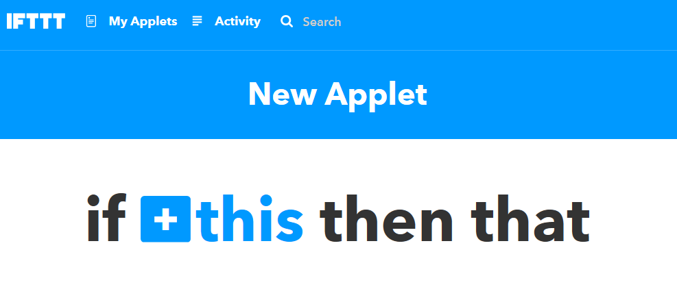
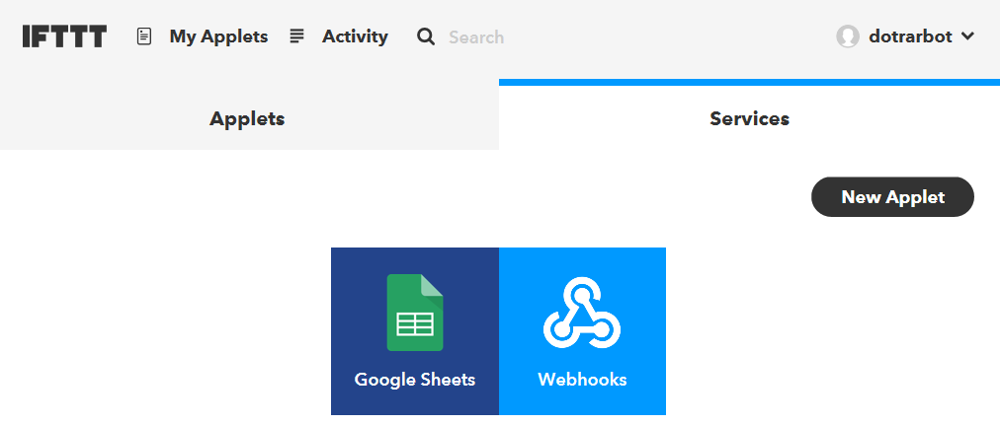

# WiFi Datalogger
 Use ESP8266 and IFTTT Services to control the cloud

| Input | Output | 
| ----- | ------ | 
| Sensors | Graphs |

<!-- TOC -->

- [WiFi Datalogger](#wifi-datalogger)
    - [Bill of materials](#bill-of-materials)
    - [Software & Libraries](#software--libraries)
    - [System overview](#system-overview)
        - [Circuit Connections](#circuit-connections)
        - [IFTTT Setup](#ifttt-setup)
    - [Integration](#integration)
    - [Use](#use)
    - [Future improvements](#future-improvements)
    - [Further reading](#further-reading)

<!-- /TOC -->

## Bill of materials 

| Qty | Code | Description | 
| --- | ---- | ----------- | 

## Software & Libraries

This project uses the IFTTT service, found at
* https://ifttt.com/discover

It also uses the following arduino library:

| Library | Author | Version |
| --- | --- | --- | 
| ArduinoJson | Benoit Blanchon | 6.11.2 |

## System overview 

Luckily for us, the heavy lifting is done through the IFTTT service, which makes things a lot simplier. IFTTT Provides a url that we can access with our ESP8266 and send data to; When the data is uploaded, IFTTT can then apply it to any other serivce that you want; in our case we will put it on a [Google Sheets](https://www.google.com/sheets/about/) spreadsheet.

The XC3802 board only has 1 analog pin, up to 1 volt, which is pretty insufficient for most cases, so we use the MCP3008 chip ([ZK8868](https://jaycar.com.au/p/ZK8868)) as our Analog to Digital converter (8 channels, 5V, 10bit resolution - beefy!) and receive the information on the ESP to send to IFTTT.

One limitation of the free IFTTT service is that you can only upload 3 values at a time, but that can be overcome by the ArduinoJson library or by doing some [bit manipulation](https://codeburst.io/your-guide-to-bit-manipulation-48e7692f314a)

### Circuit Connections

### IFTTT Setup
<!-- 

-->

## Integration
<!-- How to join it all together -->
Once you have the circuit made and ready to upload data, you need to first check your webhooks in IFTTT to get the correct key and event name. 

Click on your services tab, then click on webhoooks. 

You need to press settings.

asdf

## Use

## Future improvements 

Through IFTTT you can easily connect this service to any other out there; Gmail is an obvious example, but how about notifying your android smart watch?

Got more ideas with what we can add to it? Submit a github issue and get collaborating! 

## Further reading
Please note, Jaycar does not support nor endorse any of the below links, nor offers any guarentee of their quality or suitability for your needs.

* https://arduinojson.org/
* https://www.w3schools.com/whatis/whatis_json.asp
* https://ifttt.com/about
* https://searchmicroservices.techtarget.com/definition/RESTful-API
* http://www.robert-drummond.com/2013/05/08/how-to-build-a-restful-web-api-on-a-raspberry-pi-in-javascript-2/
